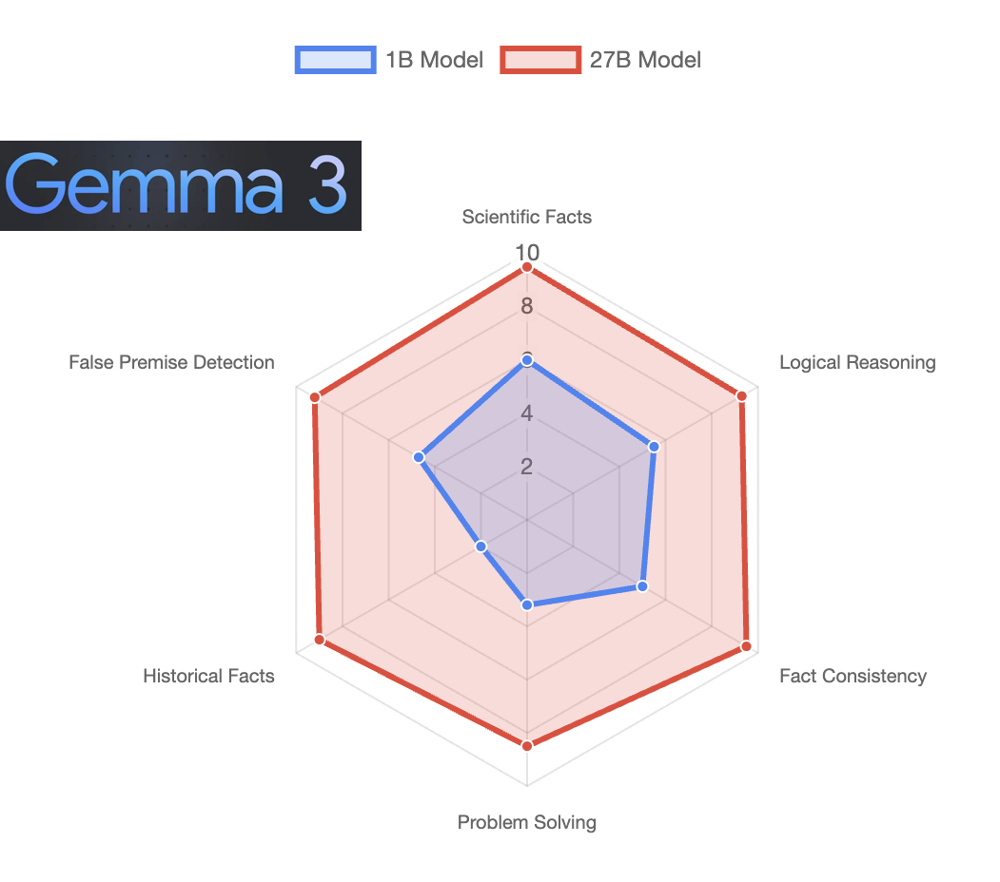

# Gemma 3 1B Comprehensive Model Evaluation

This project conducts a multi-dimensional evaluation of Google's Gemma 3 1B model through five distinct assessment streams, validated using the larger Gemma 3 27B model as a reference.

## Overview

We're investigating the capabilities and limitations of the Gemma 3 1B model (approximately 815MB on disk) through a comprehensive evaluation framework that tests different aspects of its performance.

### Evaluation Focus

1. **Knowledge Compression**: How effectively can a 1B model retain and utilize complex knowledge?
2. **Hallucination Resistance**: How well does it handle false premises and uncertain information?
3. **Problem-Solving**: Can it tackle mathematical and logical challenges effectively?
4. **Reasoning**: How robust is its analytical and inferential capability?
5. **Consistency**: Does it maintain stable outputs across different phrasings of the same query?



## Project Structure

```
.
├── streams/
│   ├── knowledge/           # Factual knowledge tests
│   ├── hallucination/       # False premise detection
│   ├── problem_solving/     # Mathematical and logical problems
│   ├── reasoning/           # Analysis and inference
│   └── consistency/         # Answer stability tests
├── query_gemma.py          # Stream-aware query script
├── validate_answers.py      # Multi-stream validation
├── generate_final_assessment.py  # Cross-stream analysis
└── requirements.txt         # Python dependencies
```

## Evaluation Streams

### 1. Knowledge Stream
- Tests factual knowledge across diverse domains
- Evaluates depth and breadth of understanding
- Measures knowledge compression efficiency

### 2. Hallucination Stream
- Presents questions with false premises
- Tests ability to detect and reject misinformation
- Evaluates uncertainty handling

### 3. Problem-Solving Stream
- Mathematical reasoning challenges
- Logic puzzles and algorithmic problems
- Step-by-step solution evaluation

### 4. Reasoning Stream
- Complex analytical scenarios
- Causal and inferential reasoning
- System thinking and pattern recognition

### 5. Consistency Stream
- Paired questions testing same knowledge
- Cross-reference answer stability
- Evaluates contextual awareness

## Evaluation Framework

### Query Phase
- Uses Ollama to run Gemma 3 1B locally
- Stream-specific prompting strategies
- Temperature set to 0 for deterministic answers
- Structured JSON output format
- Efficient batch processing

### Validation Phase
- Gemma 3 27B as evaluator via OpenRouter
- Stream-specific evaluation metrics
- Detailed qualitative feedback
- Comprehensive statistical analysis

### Assessment Metrics

#### Common Metrics (All Streams)
- Accuracy (0-10)
- Reasoning (0-10)
- Completeness (0-10)

#### Stream-Specific Metrics
1. Knowledge Stream
   - Factual correctness
   - Source alignment

2. Hallucination Stream
   - Uncertainty awareness
   - False premise detection
   - Invention score

3. Problem-Solving Stream
   - Methodology
   - Step clarity
   - Solution correctness

4. Reasoning Stream
   - Logical coherence
   - Analysis depth
   - Assumption awareness

5. Consistency Stream
   - Fact stability
   - Context awareness
   - Uncertainty disclosure

### Analysis Framework
- Per-stream statistical analysis
- Cross-stream performance metrics
- Strength/weakness identification
- Practical usage recommendations

## Setup and Usage

### Prerequisites
- Python 3.x
- Ollama with Gemma 3 1B model installed
- OpenRouter API key (for validation)

### Installation
```bash
pip install -r requirements.txt
```

### Running Evaluations

1. Query specific stream:
```bash
python3 query_gemma.py --stream knowledge
```

2. Query all streams:
```bash
python3 query_gemma.py --all
```

3. Validate specific stream:
```bash
export OPENROUTER_API_KEY='your_key_here'
python3 validate_answers.py --stream knowledge
```

4. Validate all streams:
```bash
python3 validate_answers.py --all
```

5. Generate final assessment:
```bash
python3 generate_final_assessment.py
```

### Output Structure
```
streams/
├── knowledge/
│   ├── answers/          # Raw model responses
│   └── validated/        # Validation results
│       └── stream_assessment.json
├── hallucination/
├── problem_solving/
├── reasoning/
└── consistency/
final_assessment.json     # Cross-stream analysis
```

## Expected Insights

1. **Capability Profile**
   - Strengths and weaknesses across different tasks
   - Task-specific performance characteristics
   - Reliability in different contexts

2. **Operational Guidelines**
   - Best-fit use cases
   - Task-specific confidence levels
   - Resource optimization strategies

3. **Model Understanding**
   - Knowledge compression patterns
   - Reasoning capabilities
   - Limitation boundaries

4. **Practical Applications**
   - Edge deployment recommendations
   - Task suitability guidelines
   - Integration best practices

## Technical Details
- Stream-specific prompt engineering
- Multi-dimensional evaluation metrics
- Cross-stream analysis methodology
- Statistical validation framework

## Key Findings

### Strong Performance Areas (>8.5/10)

1. **Scientific & Technical Knowledge**
   - Biology (9.0/10)
   - Physical Laws (10/10)
   - Basic Mathematics (10/10)
   - Scientific Reasoning (9.0/10)

2. **Consistency & Clarity**
   - Fact Stability (9.2/10)
   - Context Awareness (8.5/10)
   - Step-by-Step Clarity (8.5/10)
   - Logical Coherence (8.9/10)

3. **Core Reasoning**
   - Deductive Reasoning (9.0/10)
   - Logical Flow (8.9/10)
   - Assumption Awareness (7.9/10)

### Areas Needing Larger Model (27B)

1. **Complex Problem Solving**
   - Solution Correctness (5.2/10)
   - Multi-step Calculations
   - Advanced Proofs

2. **Historical & Cultural**
   - Ancient History (6.0/10)
   - Cultural Nuances
   - Historical Causation

3. **Edge Cases**
   - Novel Problems
   - High-stakes Decisions
   - Interdisciplinary Analysis

For detailed evaluation results and deployment recommendations, see [ASSESSMENT.md](ASSESSMENT.md).

## Resource Requirements

### 1B Model
- Memory: 861MB (INT4) to 4GB (FP32)
- Suitable for edge deployment
- Excellent for high-throughput, well-defined tasks

### 27B Model
- Memory: 19.9GB (INT4) to 108GB (FP32)
- Requires substantial compute
- Better for complex, quality-critical tasks

## Implications

This comprehensive evaluation provides clear guidelines for deploying the Gemma 3 1B model effectively:

1. **Ideal Use Cases**
   - Scientific documentation
   - Technical knowledge bases
   - Fact verification systems
   - Step-by-step guides

2. **Caution Areas**
   - Complex problem solving
   - Historical analysis
   - Novel/edge cases
   - High-stakes decisions

Understanding these performance boundaries helps optimize deployment strategies and guides effective model selection.

## License

This project is open source and available under the MIT License.
